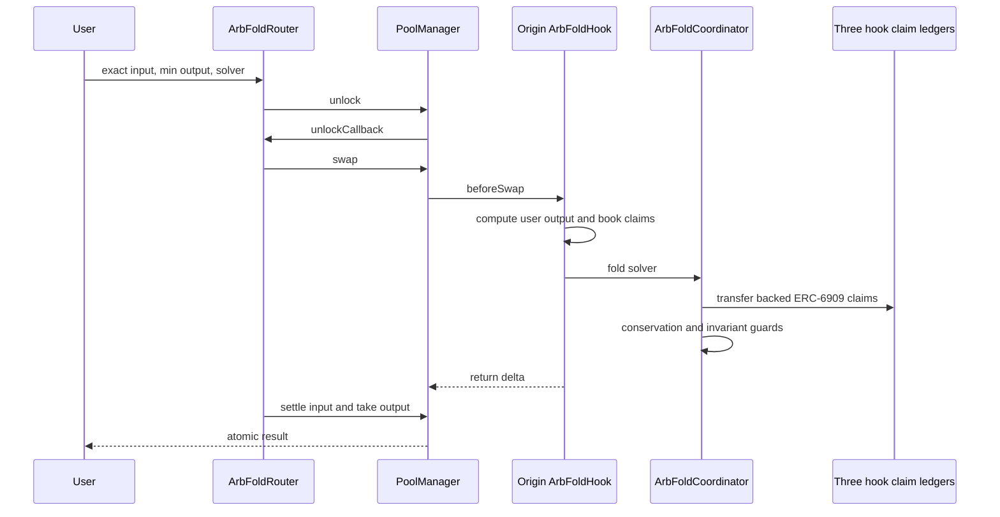

# ARBFOLD Architecture

## Scope

ARBFOLD v0.1 is a fixed network of three 30 bps hook-owned constant-product pools:

```text
AB: token A / token B
BC: token B / token C
AC: token A / token C
```

It supports exact-input swaps. Standard swaps use empty `hookData`; an ARBFOLD swap uses the minimal router to include a solver address and request a direct transition.

## Runtime sequence



The fold occurs inside `beforeSwap` **after** OpenZeppelin `BaseCustomCurve` has computed and booked the user-facing return delta. It is not a public follow-up transaction and cannot change that computed output.

## Components

### `ArbFoldHook`

[`contracts/src/ArbFoldHook.sol`](../contracts/src/ArbFoldHook.sol)

- derives from OpenZeppelin `BaseCustomCurve`;
- owns the ERC-6909 claims backing one pool’s virtual reserves;
- computes exact-input CPMM output at a fixed 30 bps fee;
- holds ERC-20 LP shares for the research pool;
- gives only the fixed coordinator operator access to its claims;
- requests folding only for the exact `ARBFOLD_DIRECT_V0` mode.

### `ArbFoldCoordinator`

[`contracts/src/ArbFoldCoordinator.sol`](../contracts/src/ArbFoldCoordinator.sol)

- binds once to exactly three initialized hooks;
- verifies manager, coordinator, token order and pool key during binding;
- reads all six virtual reserves;
- computes the best direction and closed-form cycle size;
- moves ERC-6909 claims instead of calling three full swaps;
- pays a fixed 10% external-recipient reward;
- requires conservation and non-decreasing invariants;
- reads the network once, caches the six-reserve state between rounds, and
  performs at most eight deterministic direct settlement rounds;
- makes `_applyDirect` return the runtime-checked after-state used by the next
  quote, then compares all six cached reserves with one final real `network()`
  read and reverts with `StateDrift` on any mismatch;
- emits the exact terminal residual in `FoldCompleted`; the
  `lastResidualProfit()` getter computes the current residual on demand and no
  longer writes it to storage inside `fold()`;
- packs fold calls, rounds and rewards into one telemetry word while retaining
  the original public getter ABI and explicit overflow checks;
- rejects reward recipients that alias zero, the coordinator, PoolManager or
  any registered hook.

### `CycleMath`

[`contracts/src/CycleMath.sol`](../contracts/src/CycleMath.sol)

Composes three fee-adjusted CPMM legs into a fractional-linear function and uses the closed-form optimum:

```text
x* = max((sqrt(A·B) - B) / C, 0)
```

Both directions are evaluated. Integer operations round down.

### `ArbFoldRouter`

[`contracts/src/ArbFoldRouter.sol`](../contracts/src/ArbFoldRouter.sol)

- accepts amount in, minimum amount out, deadline and solver;
- only routes through one of the configured hooks;
- initiates one `PoolManager.unlock`;
- supplies the fold request through `hookData`;
- settles all user currency deltas atomically;
- reverts the complete transaction if slippage fails.

### `ArbFoldHookDeployer`

[`contracts/src/ArbFoldHookDeployer.sol`](../contracts/src/ArbFoldHookDeployer.sol)

Provides the stable CREATE2 deployer address needed by `HookMiner`. The deploy script mines three addresses whose low bits exactly match the enabled callbacks.

## Accounting model

Along every accepted v0.1 path, the reward recipient is external to the
coordinator, PoolManager and all three registered hooks:

```text
virtualReserve(hook, token) == PoolManager.balanceOf(hook, tokenId)
```

For token A during one such direct round:

```text
hookAClaimsBefore == hookAClaimsAfter + solverReward
```

Tokens B and C remain completely inside hook claims. The underlying ERC-20 balance held by PoolManager equals the sum of all outstanding hook and solver claims.

The immutable v0 deployment did not enforce that separation. Its reproducible
counterexample remains documented in
[`THESIS_REASSESSMENT_2026-08-29.md`](THESIS_REASSESSMENT_2026-08-29.md#84-reward-address-aliasing-counterexample).
v0.1 preserves that historical result and adds atomic alias-rejection tests;
it does not reinterpret the old benchmark.

## Benchmark separation

The frozen benchmark uses two purpose-built harnesses with the same PoolManager, tokens, initial reserves and swap math:

- `AtomicBackrunHarness`: three actual `PoolManager.swap` legs plus reinjection;
- `DirectFoldHarness`: ERC-6909 transfers and equivalent persistent reserve updates.

The clean core is not substituted into the historical gas result. This prevents later safety guards, events or router changes from silently rewriting the preregistered measurement.

The v0.1 benchmark is a new versioned artifact under
`benchmark/optimized-release-candidate-results/`. At the canonical workload,
the iterative reference executes two cyclic arbitrage rounds—six swaps and two
profit reinjections. One `fold()` call applies two runtime-checked direct
settlement rounds and reaches equivalent final reserves within measured
tolerance. This is not shorthand for replacing all transaction work with one
state write.
