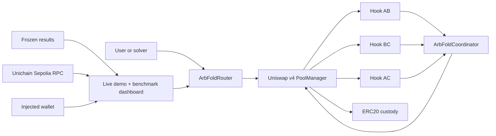

# ARBFOLD Repository Threat Model

## Executive summary

ARBFOLD’s highest-risk surface is the deliberate use of Uniswap v4 return deltas and hook-owned ERC-6909 claims: any divergence between virtual reserves, claim ownership and underlying PoolManager backing can create unbacked output or strand funds. The next risks are coordinator authorization, arithmetic/rounding across a multi-pool transition and unsupported token behavior. v0.1 adds per-round checks, a final cached-state versus live-state comparison, packed-telemetry overflow guards and forbidden reward-recipient aliases. These controls remain appropriate only for local/testnet research and do not authorize mainnet capital.

## Scope and assumptions

In scope:

- `contracts/src/` runtime contracts;
- `contracts/script/DeployArbFold.s.sol` deployment path;
- `contracts/test/` security properties;
- `benchmark/arbfold-foundry/` only as the reference comparison;
- `app/` for live RPC integrity and construction of research-testnet
  transactions; the injected wallet and its key custody remain out of scope.

Out of scope:

- production key management, multisig operations and monitoring;
- the general convex optimizer from the Defensive Rebalancing paper;
- integrations with existing pools, external routers or block builders.

Assumptions established by the project scope:

- intended usage is a research-grade UHI10 demonstration on a local chain or testnet, never unaudited mainnet deployment;
- the network is exactly three new hook-owned CPMMs with standard 18-decimal ERC-20s;
- tokens do not rebase, charge transfer fees, invoke callbacks or return malformed data;
- anyone may trade, while only the three configured hooks may invoke reserve folding;
- solver selection is permissionless through the originating route and a fixed 10% share is experimental;
- there is no proxy, upgrade, oracle or arbitrary external callback target.

Open questions that would materially change risk ranking:

- A production target chain and router allowlisting policy are intentionally unspecified.
- A production solver/orderflow authorization model is intentionally unspecified.
- No token allowlist or independent audit exists because production deployment is out of scope.

## System model

### Primary components

- **User/recipient:** supplies exact-input amount, minimum output, deadline and fixed reward-recipient address through `ArbFoldRouter.swapExactInput`.
- **ArbFoldRouter:** opens one PoolManager unlock, invokes the swap and settles user deltas (`contracts/src/ArbFoldRouter.sol`).
- **ArbFoldHook ×3:** owns each pool’s ERC-6909 claims and virtual reserve ledger; returns custom swap deltas (`contracts/src/ArbFoldHook.sol`).
- **ArbFoldCoordinator:** computes and applies direct multi-pool claim transfers with safety checks (`contracts/src/ArbFoldCoordinator.sol`).
- **PoolManager:** authoritative custody, lock/unlock and ERC-6909 accounting boundary.
- **Deployment tooling:** mines permission-encoded hook addresses and configures the immutable network (`contracts/script/DeployArbFold.s.sol`).
- **Dashboard:** loads frozen benchmark JSON separately from live Unichain
  Sepolia reads, exposes a no-wallet `eth_call`, and asks an injected wallet to
  sign demo-token mint/approval and router execution (`app/`). The page never
  receives a private key.

### Data flows and trust boundaries

- User → ArbFoldRouter: amount, direction, minimum output, deadline and solver over an EVM call; no identity authentication; amount/deadline/solver/hook are validated.
- ArbFoldRouter → PoolManager: encoded request over `unlock`; PoolManager is immutable in the router; only PoolManager can call `unlockCallback`.
- PoolManager → ArbFoldHook: swap parameters and `hookData` over `beforeSwap`; BaseHook enforces `onlyPoolManager`; fold mode and solver encoding are validated.
- ArbFoldHook → ArbFoldCoordinator: solver address over `fold`; coordinator accepts calls only from the three one-time configured hooks.
- ArbFoldCoordinator → PoolManager: ERC-6909 `transferFrom`; each hook explicitly sets only the fixed coordinator as operator.
- PoolManager ↔ ERC-20 tokens: settlement and custody; safe only under the standard-token assumption.
- Frozen results → dashboard: benchmark JSON is bundled at build time and kept
  separate from live state.
- Public RPC → dashboard: chain ID, receipts, bytecode, counters and reserves;
  the UI fails closed if verification fails.
- Browser wallet → testnet contracts: explicit user-approved transactions on
  chain 1301; the router address and exact demo-token allowance come from the
  validated manifest.

#### Diagram

## Assets and security objectives

| Asset | Why it matters | Security objective (C/I/A) |
|---|---|---|
| Underlying ERC-20 custody | Backs every claim and user output | I, A |
| ERC-6909 hook claims | Represents spendable pool reserves | I, A |
| Six virtual reserves | Drives pricing and invariant checks | I |
| User input/output delta | Must settle atomically at accepted slippage | I, A |
| Fixed external-recipient reward claims | Must be bounded and paid once | I |
| Hook/coordinator configuration | Defines which contracts may move claims | I |
| Benchmark artifacts | Separately support optimized v0.1, historical release 19.12%, earlier clean-core 18.86%, and frozen-harness 39.58% claims | I |
| Deployment key | Controls only research deployment operations | C, I |
| Wallet transaction intent | Must target chain 1301 and the committed demo contracts | I |

## Attacker model

### Capabilities

- submit arbitrary exact-input swaps, directions, amounts, deadlines, minimum outputs and solver addresses;
- call public hook, coordinator, router and deployer entry points directly;
- reorder or front-run public transactions in a realistic mempool;
- create cyclic reserve states through trading;
- deploy lookalike hooks/tokens and attempt coordinator misconfiguration before the one-time binding;
- exploit Solidity arithmetic, rounding, callback ordering or ERC-6909 operator mistakes.

### Non-capabilities

- cannot call hook callbacks as PoolManager because `BaseHook` checks `msg.sender`;
- cannot alter immutable manager/coordinator/token addresses after deployment;
- cannot reconfigure hooks after the one-time binding;
- cannot make an externally visible partial transition survive a transaction revert;
- is not assumed to compromise the deployer key or PoolManager implementation in the research model.

## Entry points and attack surfaces

| Surface | How reached | Trust boundary | Notes | Evidence (repo path / symbol) |
|---|---|---|---|---|
| Exact-input route | Public EVM call | User → Router | Validates hook, deadline, amount, solver and post-settlement output | `contracts/src/ArbFoldRouter.sol::swapExactInput` |
| Unlock callback | PoolManager callback | PoolManager → Router | Rejects all non-manager callers | `contracts/src/ArbFoldRouter.sol::unlockCallback` |
| Custom swap delta | PoolManager callback | PoolManager → Hook | Critical return-delta accounting | `contracts/src/ArbFoldHook.sol::_beforeSwap` |
| CPMM math/state update | Hook internal | Untrusted swap params → reserves | Exact-input only; integer floor rounding | `contracts/src/ArbFoldHook.sol::_getUnspecifiedAmount` |
| Liquidity deposit/withdrawal | Public hook API | LP → Hook/PoolManager | Single initial funding model; shares are ERC-20 | `ArbFoldHook::_getAmountIn`, `_getAmountOut`, `_burn` |
| Coordinator approval | Public hook call | Caller → Hook | Only grants the immutable coordinator operator rights once | `ArbFoldHook::authorizeCoordinator` |
| Network configuration | Admin call | Deployer → Coordinator | One-time token/pool/manager validation | `ArbFoldCoordinator::configureHooks` |
| Direct fold | Configured hook call | Hook → Coordinator | Maximum eight rounds; fixed external-recipient reward; residual emitted and computed on demand | `ArbFoldCoordinator::fold` |
| Claim movement | Coordinator internal | Coordinator → PoolManager | Security-critical multi-ledger transition | `ArbFoldCoordinator::_applyDirect` |
| CREATE2 hook deployment | Public factory call | Operator → Deployer | Salt is public; constructor validates permission bits | `ArbFoldHookDeployer::deploy` |
| Demo-token mint | Public EVM call | Any caller → demo token | Testnet-only; not a scarcity asset | `contracts/src/DemoToken.sol::mint` |
| Live dashboard | Browser load/click | Files + RPC + wallet → Browser | React/Vite client verifies public evidence; dry-run is unsigned; writes require explicit wallet confirmation | `app/src/` |

## Top abuse paths

1. **Create unbacked output:** attacker finds a return-delta path where virtual reserves change without matching ERC-6909 burns/mints, then swaps out underlying assets. Impact: PoolManager backing failure and loss to later users.
2. **Move another hook’s claims:** attacker impersonates/configures a hook or gains operator permission, invokes `fold`, and transfers reserve claims to a chosen address. Impact: direct pool reserve theft.
3. **Exploit cached or stale state:** transition logic trusts memory after a defective or malicious hook update. Impact: later rounds quote a state that was not actually applied. v0.1 reads once, retains per-round conservation/invariant guards, then compares every cached reserve with a fresh final `network()` read and reverts with `StateDrift` on mismatch.
4. **Trigger arithmetic edge behavior:** attacker selects reserve/input magnitudes that overflow normalization, underflow reserves or leave profitable residual cycles. Impact: denial of service or unsafe state if checks are bypassed.
5. **Use unsupported tokens:** fee-on-transfer or reentrant token makes settlement received amount differ from assumed amount. Impact: backing drift or callback reentrancy.
6. **Capture ordering/reward:** searcher front-runs the originating route or triggers the same opportunity with itself as reward recipient. Impact: intended recipient changes and adoption economics degrade. v0.1 rejects accounting-boundary aliases but does not create an ordering guarantee or recipient-pricing market.
7. **Mislead judges/users:** dashboard or README shows the gas pass while hiding the failed LP-value gate, or presents an `eth_call` as a transaction. Impact: integrity/reputation failure. The UI displays both results and labels dry-run versus signed execution.
8. **Malicious deployment metadata:** a changed manifest directs wallet approval
   or execution to a lookalike contract. Impact: testnet token approval or
   misleading evidence. The page validates address/transaction shape, verifies
   bytecode and pins the built manifest; production wallet safety is not claimed.
9. **Alias the reward recipient with an accounting boundary:** this was a valid
   v0 attack when a caller selected a registered hook. v0.1 rejects zero, the
   coordinator, PoolManager and all three hooks before changing state; tests
   require complete atomic rollback for each alias. Other contracts remain
   allowed so smart accounts and vaults are not rejected generically.

## Threat model table

| Threat ID | Threat source | Prerequisites | Threat action | Impact | Impacted assets | Existing controls (evidence) | Gaps | Recommended mitigations | Detection ideas | Likelihood | Impact severity | Priority |
|---|---|---|---|---|---|---|---|---|---|---|---|---|
| TM-001 | Malicious trader | A discrepancy exists between return deltas, claims and reserve storage | Extracts output backed only in one ledger | Pool insolvency | Custody, claims, reserves | `ArbFoldHook::_beforeSwap`; claims/backing invariants in `ArbFoldInvariant.t.sol` | Experimental base; no formal proof | Formally specify all three ledgers; add differential and symbolic tests; independent audit before deposits | Alert when reserve != claim or backing != total claims | Medium | High | high |
| TM-002 | Unauthorized caller or bad configuration | Hook identity/operator checks are bypassed or configured incorrectly | Transfers hook claims through coordinator | Reserve theft | Claims, configuration | `configureHooks` validates manager/coordinator/pair; `fold` checks `isHook`; one-time config | Admin is single deployer during setup | Use deterministic deployment manifest and multisig only for any future production setup | Index `HooksConfigured`, `OperatorSet` and unexpected claim transfers | Low | High | high |
| TM-003 | Arithmetic adversary | Extreme reserves/input or rounding boundary | Causes overflow, underflow, invariant loss or material residual | Revert/DoS or pool loss | Reserves, availability | bounded normalization; max 8 rounds; independent copy; conservation/invariant guards; fuzz/invariants | Current fuzz domain is research-scale; no SMT proof | Add bounded domain assertions, full-direction fuzzing, Halmos/Certora proof and decimal-aware math | Emit/monitor residual and round count; alert at max rounds | Medium | High | high |
| TM-004 | Non-standard token | Pool accepts callback, fee-on-transfer or rebasing token | Settlement amount differs or reenters | Backing drift, DoS | Custody, claims | Scope explicitly restricts tokens; SafeERC20 path in dependency | No onchain token allowlist | Hardcode audited token set or adapter; reentrancy analysis; balance-difference settlement | Compare underlying balances to claim supply after each transaction | Medium if unrestricted | High | high |
| TM-005 | LP/share holder | Liquidity is withdrawn while network remains configured | Drains one custom pool and makes cycle math unusable | Availability loss | Pool availability | Atomic transactions prevent mid-swap withdrawal; reserve ledger updates on `_burn` | No network pause/minimum reserve lifecycle | Disallow full withdrawal while configured or add explicit decommission state | Monitor reserve floors and full-share redemption attempts | Medium | Medium | medium |
| TM-006 | Searcher/builder | Public transaction and profitable cycle | Front-runs or captures the fixed reward | Lost opportunity; not accounting theft | Recipient economics, availability | fold is atomic in originating unlock; reward fixed at 10% | No sequencing/private-orderflow mechanism | Document the permissionless recipient model; optionally bind a signed plan or private submission later | Compare originator and reward recipient; measure failed opportunities | High | Low | medium |
| TM-007 | Malicious UI/repository editor | Can alter published files or branch | Changes displayed benchmark or omits failed gate | Misrepresentation | Benchmark integrity | freeze/raw hashes; README and immutable report preserve the rejected claim; UI data is generated from raw JSON | No signed release artifact/CI verification yet | CI recompute hashes and tests; signed release tag; retain raw-data generation | Verify hashes in CI and before video/submission | Low | Medium | low |
| TM-008 | Arbitrary callback caller | Attempts direct callback invocation | Calls router/hook callback outside PoolManager lock | Unauthorized state change | Reserves, settlement | `BaseHook.onlyPoolManager`; router `NotPoolManager` | Relies on immutable manager correctness | Retain immutable manager and callback unit tests | Track reverted unauthorized callbacks in testing | Low | High | low |
| TM-009 | Malicious site/repository editor | Can replace the dashboard build or manifest | Redirects testnet approval/execution to a lookalike address | Misleading demo or testnet token approval | Wallet intent, evidence integrity | Chain/manifest schema gate, receipt and bytecode checks, explicit wallet confirmations, testnet-only assets | No content-signing or production wallet guarantee | Publish from protected branch, retain CI/build checks and commit-pinned addresses | Compare connected chain and wallet transaction destination to manifest | Low | Medium | medium |
| TM-010 | Arbitrary router caller | Chooses zero, coordinator, manager or a registered hook as reward recipient | Attempts to make reward ownership alias an accounting boundary | Claim/reserve drift if accepted | Claims, virtual reserves, LP withdrawals | v0.1 `InvalidSolver` guard rejects all six forbidden aliases before writes; atomicity regressions cover each case | Immutable v0 deployment still lacks this guard; no production audit | Preserve v0 warning; require v0.1 or later plus audit for any new deployment | Alert on rejected alias calls and compare every hook claim to reserves | Low in v0.1; high in v0 | High | medium |

## Criticality calibration

- **Critical:** unauthenticated repeatable theft or permanent insolvency with the normal research setup. Examples: arbitrary transfer of all hook claims; return delta that creates unbacked user output.
- **High:** realistic loss of some reserves or persistent accounting corruption requiring a particular swap/token/configuration. Examples: non-standard token backing drift; arithmetic path accepting an invariant decrease; coordinator identity bypass; the historical v0 reward alias.
- **Medium:** availability or economic-integrity damage without reserve theft. Examples: configured pool fully withdrawn; solver opportunity front-run; maximum-round DoS.
- **Low:** research-presentation or local deployment issues with straightforward recovery. Examples: stale static dashboard values caught by hashes; unauthorized callback that always reverts; demo token freely minted as documented.

## Focus paths for security review

| Path | Why it matters | Related Threat IDs |
|---|---|---|
| `contracts/src/ArbFoldHook.sol` | Critical return-delta, reserve and liquidity-share accounting | TM-001, TM-003, TM-004, TM-005 |
| `contracts/src/ArbFoldCoordinator.sol` | Operator privilege and multi-pool claim transition | TM-002, TM-003, TM-006, TM-010 |
| `contracts/src/CycleMath.sol` | Closed-form normalization, rounding and residual behavior | TM-003 |
| `contracts/src/ArbFoldRouter.sol` | User slippage, callback authorization, reward address and atomic settlement | TM-001, TM-004, TM-008, TM-010 |
| `contracts/src/ArbFoldHookDeployer.sol` | Permission-bit deployment and address assumptions | TM-002 |
| `contracts/test/ArbFoldInvariant.t.sol` | Executable backing and monotonicity security properties | TM-001, TM-003 |
| `benchmark/arbfold-foundry/src/BenchmarkHarnesses.sol` | Correctness of the public execution comparator | TM-007 |
| `benchmark/arbfold-results/` | Integrity of measured and rejected claims | TM-007 |
| `app/src/App.tsx`, `app/src/hooks/useSwapLab.ts` | Public RPC verification, contextual exact approvals and signed demo transaction construction | TM-007, TM-009 |

## Notes on use

- All runtime entry points discovered in `contracts/src/` are represented above.
- Each trust boundary appears in at least one threat or explicit low-risk control.
- Runtime contracts are separated from demo deployment, benchmark harnesses and static UI.
- Context assumptions come directly from the authorized UHI10 research scope: local/testnet experiment, no production claims and no mainnet deposits.
- Production chain, token allowlist, solver authorization and router distribution remain intentionally open; choosing any of them would require a new threat-model review.
